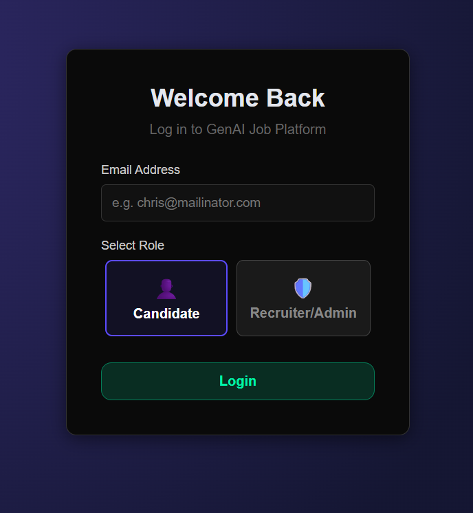
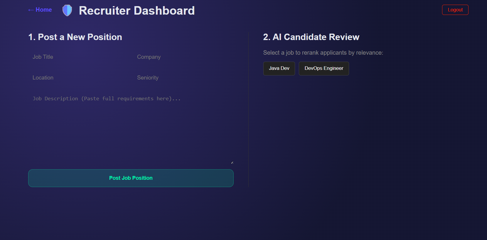
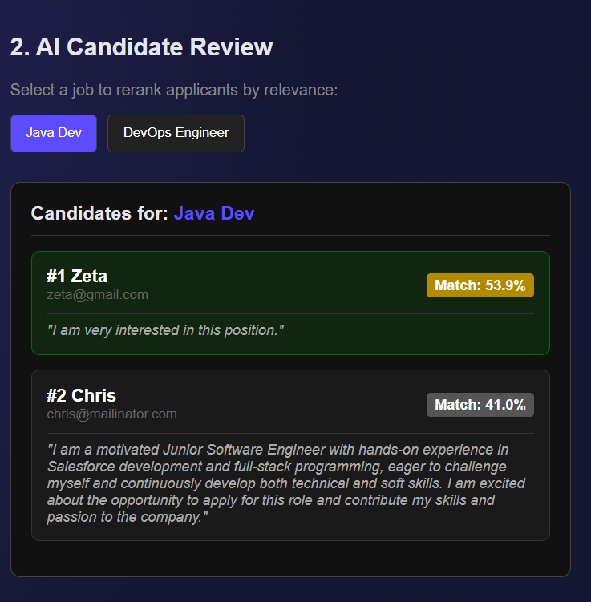
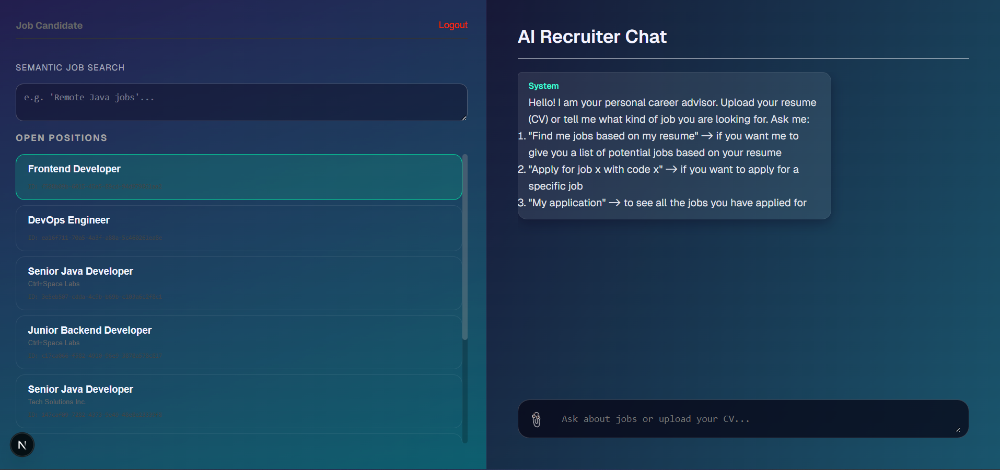
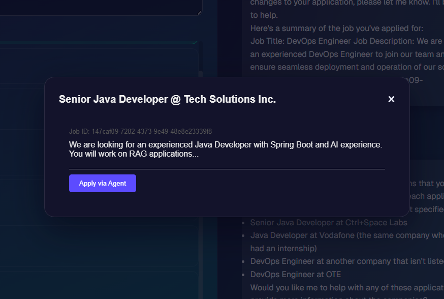
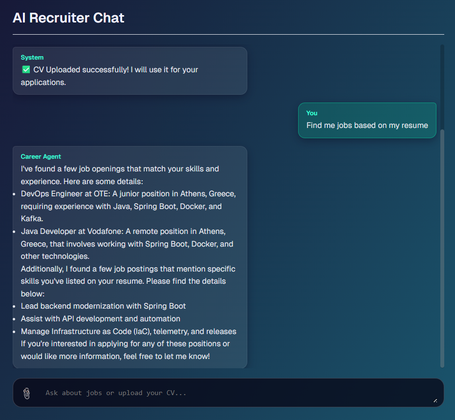
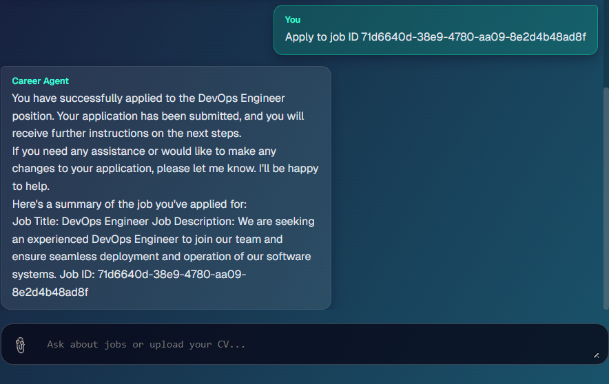
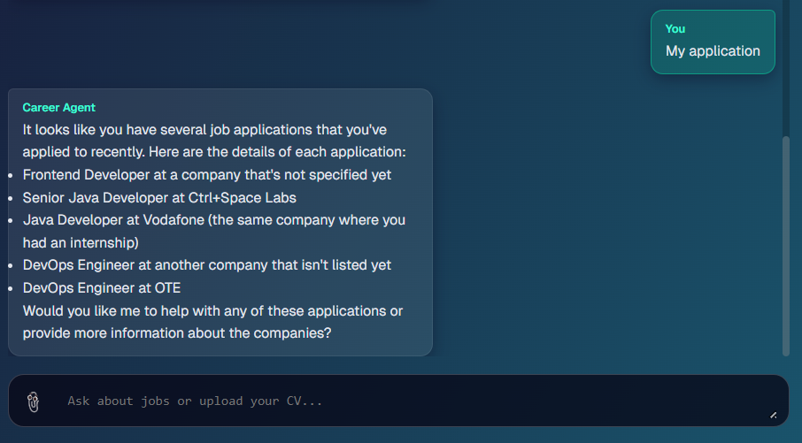

# GenAI Job Finder Platform 🚀
### GenAI for Developers #25.11 – Monorepo

> A next-generation job search and recruitment platform powered by Generative AI (LLMs, RAG, Reranking).

This repository contains the end-to-end implementation for the **GenAI for Developers** course. It demonstrates a full-stack application where **Candidates** can use an AI Agent to find jobs based on their CV, and **Recruiters** can use AI to automatically rank applicants based on relevance using Vector Search and Reranking models.

---

## 📸 Application Tour & Screenshots

### 🔐 Authentication
Secure role-based login (Admin vs User) using JWT tokens.



---

### 🛡️ Recruiter Workflow (Admin Role)

**1. Admin Dashboard & Overview:**
A centralized hub where recruiters can manage all job postings, check their status, and access AI tools.


**2. Job Posting:**
Admins can post detailed job descriptions which are then chunked and vectorized for semantic search.

**3. AI Candidate Ranking (The "Magic"):**
By selecting a job, the backend sends the job description and all applicant CVs to **Voyage AI**.


**4. Detailed AI Analysis:**
The result is a sorted list of candidates by semantic relevance (Score %), allowing recruiters to focus on the best matches immediately.

---

### 👤 Candidate Workflow (User Role)

**1. The AI Career Agent:**
Upon logging in, the user is greeted by the AI Agent, ready to assist with their career goals.


**2. CV Upload & Context Injection:**
The user uploads their PDF CV. The system parses the text and injects it into the LLM's system prompt. The Agent now "knows" the user's skills.

**3. Job Details View:**
Candidates can view full details of a job posting to understand requirements before applying or asking the agent about it.


**4. Semantic Job Search (Tool Use):**
The user can ask for jobs in natural language (e.g., "find me jobs based on my cv"). The Agent uses the `search_jobs` tool and Vector Search to find relevant positions.


**5. Applying via AI (Tool Use):**
The user can instruct the agent to apply for a specific job. The agent uses the `apply_to_job` tool to handle the database transaction.


**6. Tracking Applications (Tool Use):**
The user can ask to see their history. The agent uses the `get_my_applications` tool to fetch current application statuses.


---

## ✨ Key Features Summary

* **Semantic Job Search:** Search for jobs using natural language backed by PostgreSQL Vector Search (pgvector).
* **AI Career Agent (Llama 3.2):** A conversational assistant that uses **Tool Calling** to interact with the backend.
* **CV Parsing:** Automatic extraction of text from PDF resumes.
* **AI Candidate Ranking (Voyage AI):** Reranks applicants based on CV-to-Job Description similarity.

---

## 🏗️ Architecture & Components

This project is split into three components: a PostgreSQL + Flyway database module, a Spring Boot backend, and a Next.js frontend.

- **`genai-db`**: Database module with PostgreSQL (via Docker Compose) and Flyway migrations that create and seed the schema.
- **`genai-be`**: Java Spring Boot backend exposing APIs, connecting to the PostgreSQL database, and integrating with LLM providers (Ollama & Voyage AI).
- **`genai-fe`**: Next.js (React) frontend providing a UI for interacting with GenAI features and the backend APIs.

---

## 🚀 How to Start

### Prerequisites
* **Docker Desktop**
* **Java 21+** & Maven
* **Node.js** (v18+) & npm
* **Ollama** (running locally with `llama3.2` model pulled)

### Step 1: Database (`genai-db`)
Start the PostgreSQL container and apply migrations using Docker Compose:

```bash
cd genai-db
docker compose up
```

### Step 2: AI Model Setup (Ollama)
Ensure Ollama is running and pull the required model for the Chat Agent:

```bash
ollama pull llama3.2
ollama serve
```
* The backend expects Ollama to be listening on http://localhost:11434

### Step 3: Backend (genai-be)
Configure your API keys (specifically for Voyage AI) in src/main/resources/application.properties and run the Spring Boot app:

```bash
cd genai-be
./mvnw spring-boot:run
```

* The backend server starts on port 8080.

### Step 4: Frontend (genai-fe)
Install dependencies and start the Next.js development server:

```bash
cd genai-fe
npm install
npm run dev
```

* The frontend UI is accessible at http://localhost:3000.

## 🧪 Testing Credentials
The database is pre-seeded with the following users for testing:

| Role | Email | 
| :--- | :--- | 
| **Admin** | `pinelopi@gmail.com` | 
| **User** | `zeta@gmail.com` |


## 🧠 AI Workflow Explained
1. Ingestion: When a User uploads a CV, the backend parses the PDF and stores the text in the app_user table.
2. Context Injection: When the user chats with the Agent, the System Prompt is dynamically updated with the user's CV content so the Agent "knows" the user.
3. Tool Calling: The Agent (Llama 3.2) decides when to call specific tools:
   * search_jobs: Performs semantic search in the database. 
   * apply_to_job: Creates an application record. 
   * get_my_applications: Retrieves history.
4. Reranking (Admin): When an Admin views applicants, the backend sends the Job Description and all Applicant CVs to the Voyage AI Rerank API to get a sorted list based on semantic similarity.
